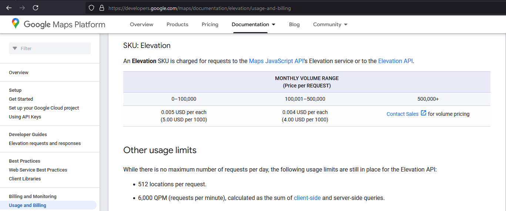

# FinalYearProject
This Repository contains the documentation for my Final Year Project.

# Project Title
Missing Persons Route Optimisation.

This project is going to use various technologies to assess the nearby terrain where a person went missing to come up with a viable route to rescue the injured/lost party.

## Literature to Consider

To-Do List
- [x] Draw a bounding box around the summit of Carrauntoohil to set a search area.
- [x] Break the bounding box down into a 2d array of coordinates to create a 3d model.
- [x] Write a 2D Python Array to call the Google Elevation API for each point in the above bounding box.
- [ ] Research algorithms for navigating 3d spaces.

## API Pricing

## Links and Resources
[Point Cloud Visualization Python](https://learngeodata.eu/visualise-massive-point-cloud-in-python/)
[Pathfinding over 3D spaces](https://ascane.github.io/assets/portfolio/pathfinding3d-report.pdf)

# Defining Search and Rescue
Search and rescue (SAR) areas are defined according to a structured and strategic approach to manage resources, cover challenging terrain, and increase the efficiency of search efforts. Here's an outline of how these areas are typically divided and organized:

### 1. **Primary Division into SAR Regions**
   - Globally, SAR regions are typically organized by international treaties like the International Maritime Organization (IMO) and the International Civil Aviation Organization (ICAO). They divide the world into large SAR regions (SRRs), where each country is responsible for SAR within its designated areas. These regions encompass both maritime and aerial domains.
   - In the United States, for example, SAR responsibilities are split between the Coast Guard for maritime areas and the Air Force and other agencies for inland SAR.

### 2. **SAR Zones and Sectors**
   - Within each large SAR region, smaller **SAR zones** or **sectors** are established based on geography, available resources, and typical activity. These could be coastlines, mountainous areas, or dense wilderness areas that are known for frequent SAR needs.
   - Each SAR zone has a designated coordination center or base that acts as the command and control hub, deploying SAR teams and equipment.

### 3. **Gridding and Segmenting SAR Areas**
   - When an actual search is underway, SAR teams use a method called **gridding** to divide the search area into manageable squares or grids. Grids are usually assigned based on factors like:
      - The estimated location of the missing person or last known point.
      - Terrain characteristics, weather conditions, and visibility.
      - Available SAR resources and personnel.
   - These grids allow SAR personnel to search systematically and report back to the command center about what’s covered and if any signs have been found.

### 4. **Probability and Search Assignment**
   - Using a **Probability of Detection (POD)** model, search managers assign higher priorities to grids with a greater likelihood of locating the missing person or item.
   - Grids are ranked by the Probability of Area (POA) which predicts where the missing subject is likely to be based on time, conditions, and known movements. Teams may then be tasked with covering the highest POA zones first.

### 5. **Adjusting the Search Plan**
   - As more information comes in or as the search progresses, the SAR plan may change, with grids re-prioritized or extended. SAR teams may need to adapt due to changes in weather, new clues, or information provided by witnesses.

Breaking SAR areas into grids and sectors enables teams to conduct efficient, organized searches and ensure that resources are used effectively to maximize the chances of finding the missing person or object.